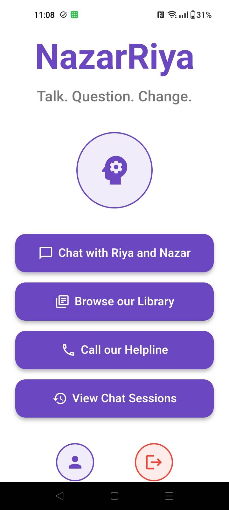
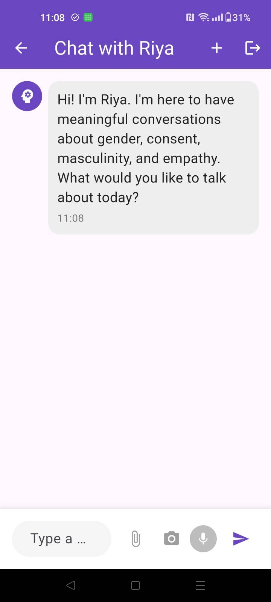
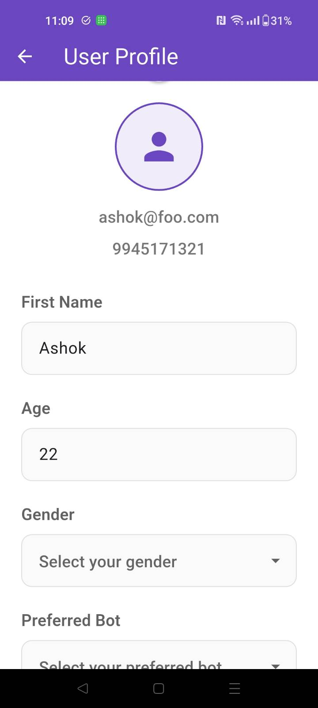
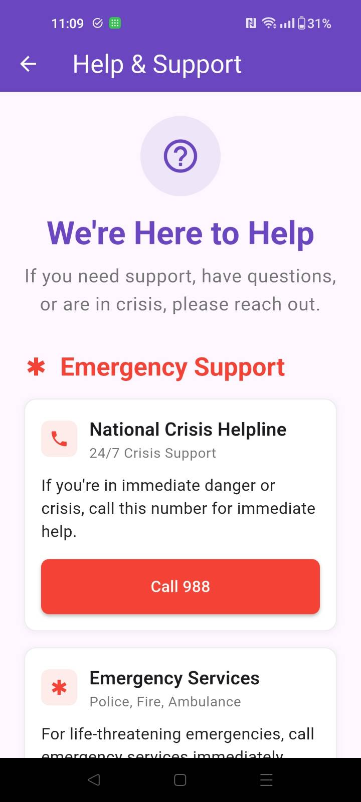

# NazarRiya: A Companion for Positive Change

**NazarRiya** (meaning *"perspective" or "viewpoint"*) is an engaging, mobile-first platform designed to spark reflection, challenge harmful social norms, and promote healthier attitudes—especially among young men.

## 👥 Meet Nazar and Riya

At the heart of NazarRiya are two relatable, lifelike characters:
- **Nazar**: A cool, empathetic young Indian man who listens without judgment.
- **Riya**: His supportive best friend, modeling respectful and healthy male-female dynamics.

Together, they act as approachable mentors—like the older siblings or neighborhood role models everyone wishes they had.

## 🌱 What We Offer

- **A Safe Space for Dialogue**  
  Users can explore difficult topics like toxic masculinity, victim blaming, and societal pressure in a non-judgmental environment.

- **Conversational AI Powered by a Custom LLM**  
  Our homegrown large language model powers meaningful, insightful conversations, enabling users to discuss their doubts and experiences openly.

- **Rich Library of Content**  
  Carefully curated educational materials support deeper understanding of gender dynamics and empathy-driven behavior.

- **WhatsApp Integration**  
  Opted-in users receive interactive tips, quizzes, and reflections via WhatsApp in a friendly, chat-based format led by Nazar and Riya.

## 🚀 Why NazarRiya?

This isn't just an app—it's a long-term companion encouraging reflection, growth, and empathy. By maintaining an ongoing dialogue across platforms, NazarRiya gently sensitizes users and contributes to real social change.

## 📱 User Guide

### Getting Started
Welcome to NazarRiya! Here's how to make the most of your journey with Nazar and Riya:

#### 🚀 Quick Start
1. **Sign Up & Login** - Create your account with basic information (name, age, location, preferred language)
2. **Choose Your Companion** - Select between Nazar or Riya as your preferred conversation partner
3. **Start Chatting** - Begin meaningful conversations about topics that matter to you

#### 💬 Core Features

**Chat with Nazar & Riya**
- Engage in open, judgment-free conversations about masculinity, relationships, and personal growth
- Get personalized responses based on your profile and conversation history
- Access your chat history and continue previous conversations anytime

**📚 Educational Library**
- Explore curated content on consent, healthy masculinity, empathy, and gender equality
- Access bite-sized, easy-to-understand articles and resources
- Learn at your own pace with content designed for young Indian men

**📞 Help & Support**
- Emergency crisis support and helpline numbers
- Mental health resources and professional counseling connections
- LGBTQ+ support and community resources
- Domestic violence support and safe spaces

**👤 Your Profile**
- Manage your personal information and preferences
- Update your preferred language and conversation partner
- Secure, encrypted data storage for your privacy

**📋 Chat Sessions**
- View and manage all your conversation history
- Resume previous conversations
- Organize your learning journey

#### 🎯 How to Use

**Starting a Conversation:**
1. Tap "Chat with Riya and Nazar" from the home screen
2. Type your question or share what's on your mind
3. Get thoughtful, personalized responses from your chosen companion

**Exploring Content:**
1. Visit the Library section to browse educational materials
2. Swipe through different topics and articles
3. Read at your own pace and return anytime

**Getting Help:**
1. Access the Help section for immediate support resources
2. Find crisis helplines, mental health support, and community resources
3. Contact our support team for app-related questions

#### 📸 Visual Walkthrough

#### 🎥 App Demo

  
   
  <em>📱 Complete app walkthrough - Click to watch on YouTube</em>

**Alternative viewing options:**
- **YouTube Shorts:** [Watch on YouTube](https://www.youtube.com/shorts/PSpktPWQcT4)
- **Full video:** [Download walkthrough video](assets/videos/walkthrough.mp4)

#### 💡 Tips for Best Experience
- Be honest and open in your conversations - Nazar and Riya are here to listen without judgment
- Explore the library regularly to deepen your understanding
- Don't hesitate to reach out for help when you need it
- Your conversations are private and secure - share what you're comfortable with

---

## 🔮 Future Plans

We envision expanding the platform with:
- New character "mascots" to address
